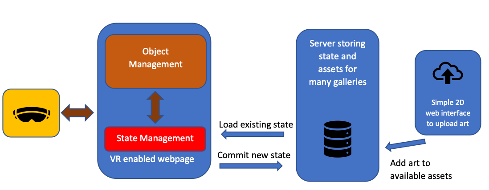

#  VR Sandbox Development logbook

----------------------------------------------------------------

### 1-20 Nov

Started work and reseaching.

- Starting to use the bolilerplate design for github pagespushed direclty to github repo, not using npm
- using budo for local development

Currently working on combining multiple elements together to create the picture frame to be spawned. Currently implemented as a template but not sure how that would work with mixin and javascript. Are the the frame, image and everthing else supposed to be separate mixins? 

Also need to figure out event listeners

https://github.com/aframevr/aframe/blob/master/examples/showcase/ui/index.html

reactive UI example - has thee of them hardcoded and using mixins - might try this but possible this isnt be the best way. 

https://aframe.io/blog/gamestate/

article on managing the gamestate. This one seeems pretty reasonable to do and will require a bunch of digging into the source code. 
THree ways to implement state are defined here

** Goal : ** implement a simple point and click spawn a frame with an image in it, possibly impelemnt state into it as well